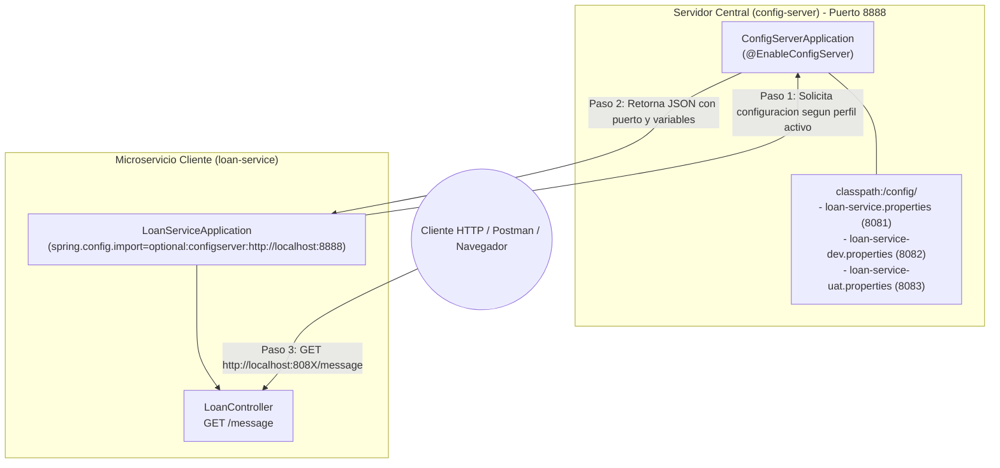

# Taller Microservicios: Spring Boot Cloud Configuration Server & Config Client


> **Integrantes del Grupo:**  
> - José Daniel Zambrano Luna  
> - Rafael Eduardo Sarmiento Peña  
>  
> **Tema:** Centralización y Externalización de Configuración en Microservicios con Spring Cloud Config  
> **Referencia Técnica:** Tutorial Oficial GeeksforGeeks Advance Java (*Spring Boot Cloud Configuration Server and Config Client*)  
> **Fecha:** Septiembre 2026  

---

## 📑 Tabla de Contenido
1. [Introducción y Objetivos](#1-introducción-y-objetivos)
2. [Arquitectura del Sistema](#2-arquitectura-del-sistema)
3. [Estructura del Proyecto](#3-estructura-del-proyecto)
4. [Paso a Paso Detallado de la Implementación](#4-paso-a-paso-detallado-de-la-implementación)
   - [Paso 1: Servidor de Configuración (config-server)](#paso-1-servidor-de-configuración-config-server)
     - [1.1. Dependencias (pom.xml)](#11-dependencias-pomxml)
     - [1.2. Habilitación del Servidor (@EnableConfigServer)](#12-habilitación-del-servidor-enableconfigserver)
     - [1.3. Configuración del Servidor (application.properties)](#13-configuración-del-servidor-applicationproperties)
     - [1.4. Archivos de Propiedades por Perfil](#14-archivos-de-propiedades-por-perfil)
   - [Paso 2: Microservicio Cliente (loan-service)](#paso-2-microservicio-cliente-loan-service)
     - [2.1. Dependencias (pom.xml)](#21-dependencias-pomxml)
     - [2.2. Conexión al Config Server (application.properties)](#22-conexión-al-config-server-applicationproperties)
     - [2.3. Clase Principal (@SpringBootApplication)](#23-clase-principal-springbootapplication)
     - [2.4. Controlador REST (@RestController y @Value)](#24-controlador-rest-restcontroller-y-value)
5. [Guía de Ejecución y Pruebas Paso a Paso](#5-guía-de-ejecución-y-pruebas-paso-a-paso)
6. [Evidencias Reales de Funcionamiento](#6-evidencias-reales-de-funcionamiento)
7. [Matriz Comparativa de Resultados](#7-matriz-comparativa-de-resultados)
8. [Preguntas Frecuentes y Consideraciones Técnicas](#8-preguntas-frecuentes-y-consideraciones-técnicas)

---

## 1. Introducción y Objetivos

En sistemas distribuidos y arquitecturas de microservicios, mantener las configuraciones dentro de cada proyecto o imagen empaquetada presenta serios inconvenientes:
- Duplicación de configuraciones.
- Necesidad de recompilar o redesplegar ante cualquier cambio de entorno.
- Falta de consistencia entre ambientes (`default`, `dev`, `uat`, `prod`).

**Spring Cloud Config** resuelve este problema ofreciendo soporte del lado del servidor y del lado del cliente para externalizar las configuraciones de manera centralizada:
1. **Config Server:** Un servicio central que almacena todas las propiedades (ficheros `.properties` o `.yml`) y las sirve mediante endpoints REST HTTP.
2. **Config Client:** Cualquier microservicio (en este caso, `loan-service`) que al iniciar descarga dinámicamente sus configuraciones desde el servidor centralizado antes de inicializar sus beans principales.

### Objetivos del Taller
- Implementar un **Spring Cloud Config Server** que lea archivos de configuración locales mediante el perfil `native`.
- Gestionar tres entornos diferenciados: `default`, `dev` (desarrollo) y `uat` (pruebas de usuario).
- Crear un microservicio cliente (`loan-service`) que consuma estas configuraciones para definir dinámicamente su **puerto HTTP** y un **mensaje de bienvenida** inyectado con `@Value`.
- Comprobar que al alternar los perfiles, el cliente cambia de puerto y respuesta sin modificar una sola línea de código Java.

---

## 2. Arquitectura del Sistema



### Flujo de Interacción entre Componentes:
1. **Arranque del Config Server (`:8888`):** Carga los archivos `.properties` desde `classpath:/config/` usando el perfil de almacenamiento `native`.
2. **Arranque y Resolución del Cliente (`loan-service`):** Mediante `spring.config.import=optional:configserver:http://localhost:8888`, el cliente contacta al servidor de configuración solicitando las propiedades del perfil activo (`default`, `dev` o `uat`).
3. **Inyección y Configuración Dinámica:** El Config Server responde con un payload JSON que contiene las propiedades (`server.port` y `application.message`), las cuales son inyectadas en el contexto de Spring antes de levantar el servidor web embebido Tomcat.
4. **Consumo por el Usuario:** El usuario realiza peticiones HTTP al microservicio en el puerto configurado dinámicamente (`8081`, `8082` o `8083`) y obtiene la respuesta correspondiente.

---

## 3. Estructura del Proyecto

```text
spring-cloud-config-taller/
│
├── config-server/                           # Servidor de configuración centralizado
│   ├── pom.xml                              # Dependencias Maven (spring-cloud-config-server)
│   └── src/
│       ├── main/
│       │   ├── java/com/example/configserver/
│       │   │   └── ConfigServerApplication.java  # Clase principal con @EnableConfigServer
│       │   └── resources/
│       │       ├── application.properties        # Configuración del servidor (puerto 8888, perfil native)
│       │       └── config/                       # Repositorio central de propiedades por perfil
│       │           ├── loan-service.properties       # Perfil Default (puerto 8081)
│       │           ├── loan-service-dev.properties   # Perfil Dev     (puerto 8082)
│       │           └── loan-service-uat.properties   # Perfil UAT     (puerto 8083)
│       └── test/java/com/example/configserver/
│           └── ConfigServerApplicationTests.java # Prueba de carga de contexto
│
├── loan-service/                            # Microservicio Cliente
│   ├── pom.xml                              # Dependencias (web, config client, devtools)
│   └── src/
│       ├── main/
│       │   ├── java/com/example/loanservice/
│       │   │   ├── LoanServiceApplication.java   # Clase principal Spring Boot
│       │   │   └── LoanController.java           # Endpoint REST GET /message
│       │   └── resources/
│       │       └── application.properties        # Importa configuración desde http://localhost:8888
│       └── test/java/com/example/loanservice/
│           └── LoanServiceApplicationTests.java  # Prueba de contexto y controlador
│
├── INFORME_EVIDENCIAS_TALLER.docx           # Informe formal con evidencias para entrega
└── README.md                                # Documentación completa paso a paso
```

---

## 4. Paso a Paso Detallado de la Implementación

### Paso 1: Servidor de Configuración (`config-server`)

El servidor actúa como el repositorio centralizado que almacena y sirve los parámetros a los clientes.

#### 1.1. Dependencias (`pom.xml`)
En el archivo `config-server/pom.xml` se incluye la dependencia fundamental del Config Server y el gestor de dependencias de Spring Cloud:

```xml
<dependencies>
    <!-- Dependencia principal del servidor de configuración -->
    <dependency>
        <groupId>org.springframework.cloud</groupId>
        <artifactId>spring-cloud-config-server</artifactId>
    </dependency>

    <!-- Dependencia para pruebas unitarias -->
    <dependency>
        <groupId>org.springframework.boot</groupId>
        <artifactId>spring-boot-starter-test</artifactId>
        <scope>test</scope>
    </dependency>
</dependencies>

<!-- Gestión de versiones de Spring Cloud -->
<dependencyManagement>
    <dependencies>
        <dependency>
            <groupId>org.springframework.cloud</groupId>
            <artifactId>spring-cloud-dependencies</artifactId>
            <version>${spring-cloud.version}</version>
            <type>pom</type>
            <scope>import</scope>
        </dependency>
    </dependencies>
</dependencyManagement>
```

#### 1.2. Habilitación del Servidor (`@EnableConfigServer`)
En `config-server/src/main/java/com/example/configserver/ConfigServerApplication.java`, se decora la clase principal con `@EnableConfigServer`:

```java
package com.example.configserver;

import org.springframework.boot.SpringApplication;
import org.springframework.boot.autoconfigure.SpringBootApplication;
import org.springframework.cloud.config.server.EnableConfigServer;

/**
 * Servidor Centralizado de Configuración de Spring Cloud.
 * La anotación @EnableConfigServer activa los endpoints REST internos
 * para consultar y servir propiedades a los clientes conectados.
 */
@SpringBootApplication
@EnableConfigServer
public class ConfigServerApplication {

    public static void main(String[] args) {
        SpringApplication.run(ConfigServerApplication.class, args);
    }
}
```

#### 1.3. Configuración del Servidor (`application.properties`)
En `config-server/src/main/resources/application.properties` se configuran las variables operativas:

```properties
# Nombre descriptivo de la aplicación
spring.application.name=config-server

# Puerto de escucha del Config Server (estándar en Spring Cloud: 8888)
server.port=8888

# Activa el perfil native para leer archivos locales sin requerir un repositorio Git remoto
spring.profiles.active=native

# Ruta dentro del classpath donde se almacenan los archivos de propiedades
spring.cloud.config.server.native.search-locations=classpath:/config
```

#### 1.4. Archivos de Propiedades por Perfil
Bajo `config-server/src/main/resources/config/` se crean los archivos que representan los tres entornos del servicio `loan-service`:

1. **`loan-service.properties` (Perfil Default):**
   ```properties
   server.port=8081
   application.message=Welcome From Default Profile
   ```
2. **`loan-service-dev.properties` (Perfil Dev - Desarrollo):**
   ```properties
   server.port=8082
   application.message=Welcome From Development Profile
   ```
3. **`loan-service-uat.properties` (Perfil UAT - User Acceptance Testing):**
   ```properties
   server.port=8083
   application.message=Welcome From UAT Profile
   ```

---

### Paso 2: Microservicio Cliente (`loan-service`)

El microservicio `loan-service` no contiene puertos fijos ni mensajes hardcodeados; todo lo obtiene del servidor de configuración.

#### 2.1. Dependencias (`pom.xml`)
En `loan-service/pom.xml` se integran los starters requeridos:

```xml
<dependencies>
    <!-- Starter Web para exponer endpoints REST y servidor Tomcat embebido -->
    <dependency>
        <groupId>org.springframework.boot</groupId>
        <artifactId>spring-boot-starter-webmvc</artifactId>
    </dependency>

    <!-- Cliente de Spring Cloud Config para comunicarse con el Config Server -->
    <dependency>
        <groupId>org.springframework.cloud</groupId>
        <artifactId>spring-cloud-starter-config</artifactId>
    </dependency>

    <!-- Herramientas de desarrollo de Spring Boot -->
    <dependency>
        <groupId>org.springframework.boot</groupId>
        <artifactId>spring-boot-devtools</artifactId>
        <scope>runtime</scope>
        <optional>true</optional>
    </dependency>

    <!-- Dependencia para pruebas automatizadas -->
    <dependency>
        <groupId>org.springframework.boot</groupId>
        <artifactId>spring-boot-starter-webmvc-test</artifactId>
        <scope>test</scope>
    </dependency>
</dependencies>
```

#### 2.2. Conexión al Config Server (`application.properties`)
En `loan-service/src/main/resources/application.properties`:

```properties
# Nombre del microservicio (debe coincidir con el prefijo de los archivos en el servidor)
spring.application.name=loan-service

# Importa las propiedades desde el Config Server centralizado
spring.config.import=optional:configserver:http://localhost:8888

# Perfil activo seleccionado (dev, uat, o default)
spring.profiles.active=dev
```

#### 2.3. Clase Principal (`LoanServiceApplication.java`)
En `loan-service/src/main/java/com/example/loanservice/LoanServiceApplication.java`:

```java
package com.example.loanservice;

import org.springframework.boot.SpringApplication;
import org.springframework.boot.autoconfigure.SpringBootApplication;

@SpringBootApplication
public class LoanServiceApplication {

    public static void main(String[] args) {
        SpringApplication.run(LoanServiceApplication.class, args);
    }
}
```

#### 2.4. Controlador REST (`LoanController.java`)
En `loan-service/src/main/java/com/example/loanservice/LoanController.java`:

```java
package com.example.loanservice;

import org.springframework.beans.factory.annotation.Value;
import org.springframework.web.bind.annotation.GetMapping;
import org.springframework.web.bind.annotation.RestController;

/**
 * Controlador REST que demuestra la inyección de propiedades dinámicas
 * provistas por el Spring Cloud Config Server.
 */
@RestController
public class LoanController {

    // La anotación @Value inyecta el valor de application.message resuelto por el Config Server
    @Value("${application.message}")
    private String message;

    /**
     * Endpoint GET /message
     * @return El mensaje configurado para el perfil activo
     */
    @GetMapping("/message")
    public String getMessage() {
        return message;
    }
}
```

---

## 5. Guía de Ejecución y Pruebas Paso a Paso

### 1. Iniciar el Servidor de Configuración
Abra una terminal en la carpeta `config-server` y ejecute:
```bash
cd config-server
mvn spring-boot:run
```
*El servidor iniciará en el puerto **8888**.*

### 2. Verificar las Propiedades en el Servidor
Puede verificar desde el navegador o terminal que el servidor está entregando la configuración:
```bash
# Para perfil dev
curl http://localhost:8888/loan-service/dev

# Para perfil uat
curl http://localhost:8888/loan-service/uat
```

### 3. Iniciar el Microservicio Cliente en Perfil DEV
En otra terminal, acceda a la carpeta `loan-service`:
```bash
cd loan-service
mvn spring-boot:run
```
*El cliente leerá el perfil `dev`, configurará automáticamente su puerto en el **8082** y cargará el mensaje correspondiente.*

Pruebe el endpoint:
```bash
curl http://localhost:8082/message
# Salida esperada: Welcome From Development Profile
```

### 4. Cambiar al Perfil UAT
Edite `loan-service/src/main/resources/application.properties` cambiando:
```properties
spring.profiles.active=uat
```
Reinicie el microservicio con `mvn spring-boot:run`. El cliente ahora iniciará en el puerto **8083**.

Pruebe el endpoint:
```bash
curl http://localhost:8083/message
# Salida esperada: Welcome From UAT Profile
```

---

## 6. Evidencias Reales de Funcionamiento

### Evidencia 1: Respuesta JSON del Config Server
Petición:
```http
GET http://localhost:8888/loan-service/dev
```
Respuesta recibida:
```json
{
  "name": "loan-service",
  "profiles": [
    "dev"
  ],
  "label": null,
  "version": null,
  "state": null,
  "propertySources": [
    {
      "name": "classpath:/config/loan-service-dev.properties",
      "source": {
        "server.port": "8082",
        "application.message": "Welcome From Development Profile"
      }
    },
    {
      "name": "classpath:/config/loan-service.properties",
      "source": {
        "server.port": "8081",
        "application.message": "Welcome From Default Profile"
      }
    }
  ]
}
```

---

### Evidencia 2: Ejecución del Cliente en Perfil `dev`
- **Log de arranque en consola:**
  ```text
  [loan-service] o.s.b.w.e.tomcat.TomcatWebServer : Tomcat started on port 8082 (http) with context path '/'
  [loan-service] c.e.l.LoanServiceApplication     : Started LoanServiceApplication in 2.068 seconds
  ```
- **Petición HTTP:**
  ```bash
  curl http://localhost:8082/message
  ```
- **Respuesta:**
  ```text
  Welcome From Development Profile
  ```

---

### Evidencia 3: Ejecución del Cliente en Perfil `uat`
- **Log de arranque en consola:**
  ```text
  [loan-service] o.s.b.w.e.tomcat.TomcatWebServer : Tomcat started on port 8083 (http) with context path '/'
  [loan-service] c.e.l.LoanServiceApplication     : Started LoanServiceApplication in 1.835 seconds
  ```
- **Petición HTTP:**
  ```bash
  curl http://localhost:8083/message
  ```
- **Respuesta:**
  ```text
  Welcome From UAT Profile
  ```

---

## 7. Matriz Comparativa de Resultados

| Perfil (`spring.profiles.active`) | Archivo de Propiedades en Servidor | Puerto HTTP Dinámico | Endpoint de Verificación | Mensaje Retornado |
| :---: | :--- | :---: | :--- | :--- |
| **`default`** | `loan-service.properties` | `8081` | `http://localhost:8081/message` | `Welcome From Default Profile` |
| **`dev`** | `loan-service-dev.properties` | `8082` | `http://localhost:8082/message` | `Welcome From Development Profile` |
| **`uat`** | `loan-service-uat.properties` | `8083` | `http://localhost:8083/message` | `Welcome From UAT Profile` |

---

## 8. Preguntas Frecuentes y Consideraciones Técnicas

### ¿Por qué `server.port=8888` en el Config Server?
En el tutorial de GeeksforGeeks, el texto indica explícitamente configurar el servidor en el puerto 8888, y en el cliente se referencia `spring.config.import=optional:configserver:http://localhost:8888`. El puerto 8888 es el estándar oficial adoptado por Spring Cloud para evitar colisiones con el puerto 8080 común en aplicaciones web.

### ¿Qué hace el prefijo `optional:` en `spring.config.import`?
El prefijo `optional:` indica que si el servidor de configuración estuviera inaccesible al arrancar el cliente, la aplicación intentará arrancar con los valores por defecto locales en lugar de fallar inmediatamente.

### ¿Cómo se empaqueta cada módulo?
Cada módulo es independiente y puede empaquetarse mediante Maven:
```bash
mvn clean package -DskipTests
```
Generando los ejecutables `.jar` correspondientes en sus respectivas carpetas `target/`.

---

## 👥 Integrantes del Grupo / Autores
- **José Daniel Zambrano Luna**
- **Rafael Eduardo Sarmiento Peña**

- **Repositorio GitHub:** [spring-boot-cloud-configuration-server](https://github.com/josezambranol/spring-boot-cloud-configuration-server)
- **Informe de Evidencias:** [Informe-Taller-Spring-Cloud-Config.docx](Informe-Taller-Spring-Cloud-Config.docx)
- **Documento Adicional:** [INFORME_EVIDENCIAS_TALLER.docx](INFORME_EVIDENCIAS_TALLER.docx)
